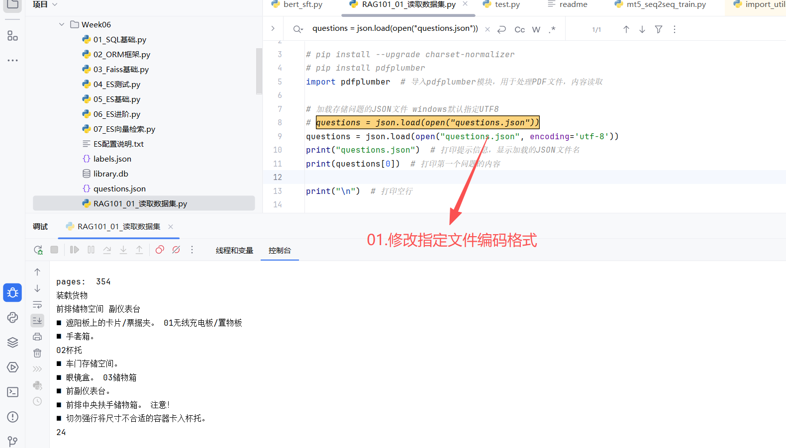
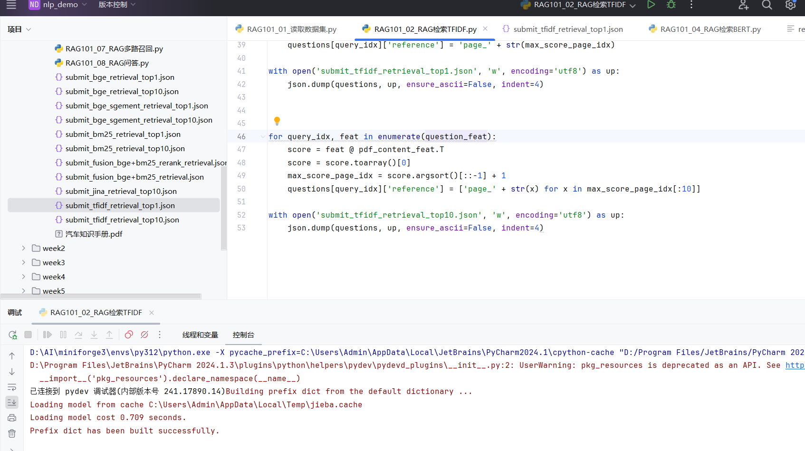
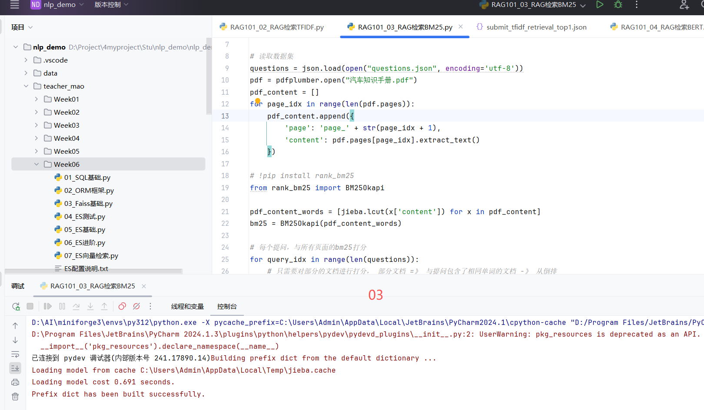
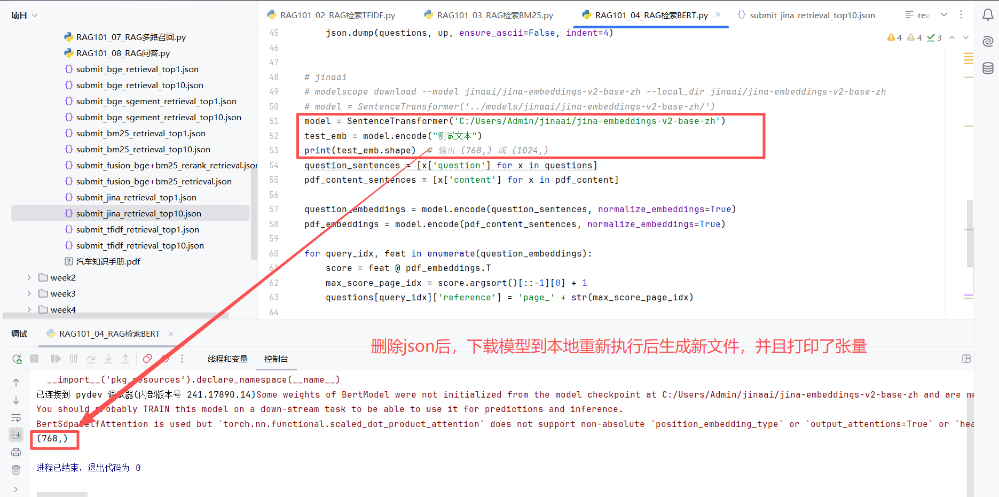
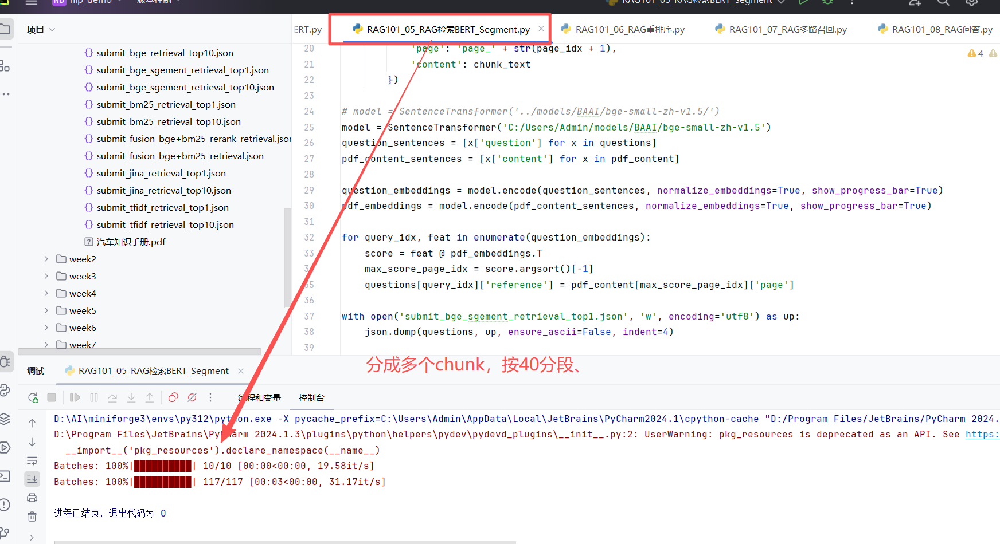
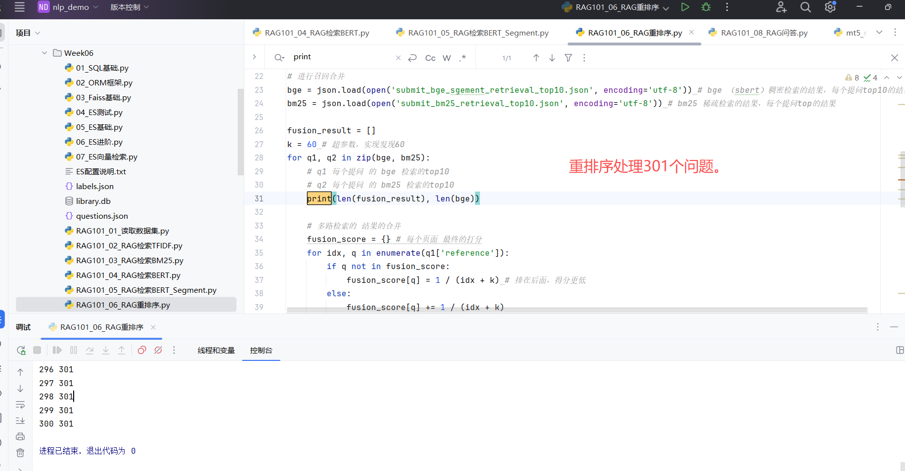
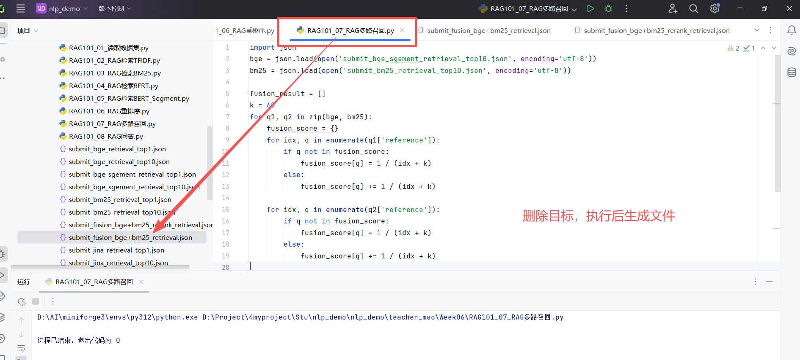
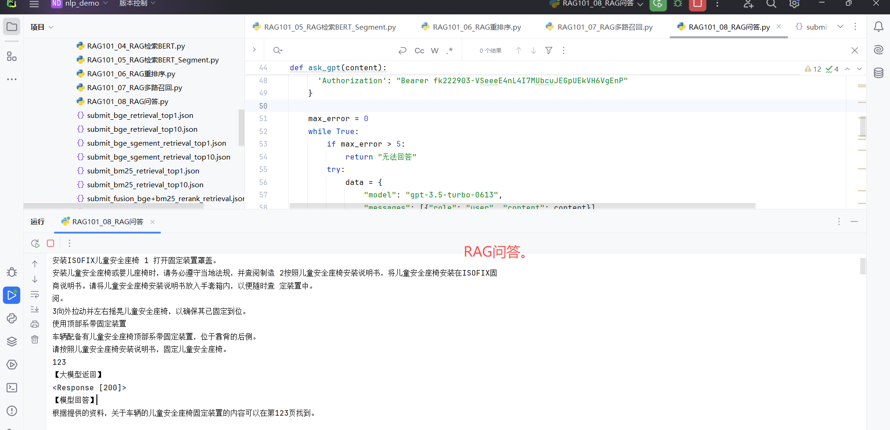
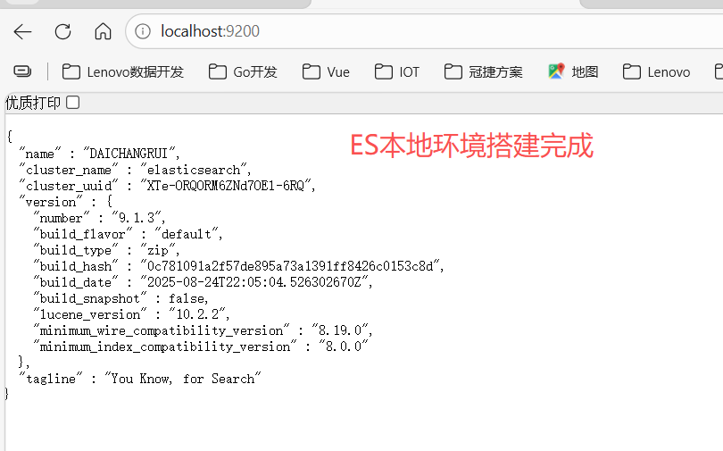

##RAG101_01_读取数据集 执行结果

##RAG101_02_RAG检索TFIDF 执行结果

##RAG101_03_RAG检索BM25

##RAG101_04_RAG检索BERT

##RAG101_05_RAG检索BERT_Segment

##RAG101_06_RAG重排序

##RAG101_07_RAG多路召回

##RAG101_08_RAG问答

##作业2：ES本地环境搭建
