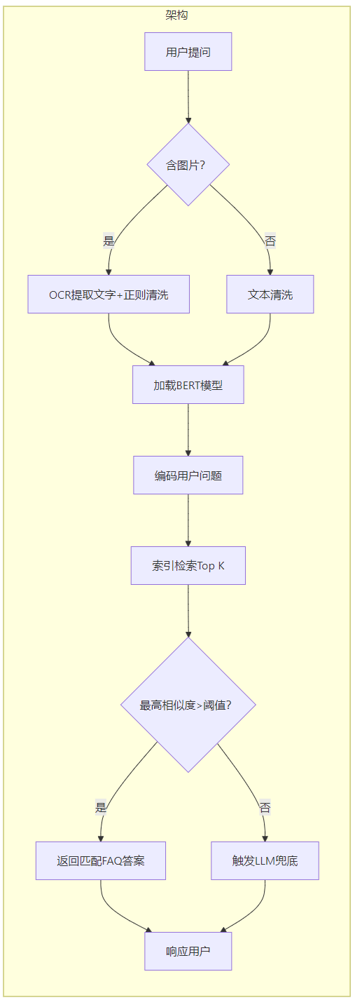

#   架构
用户查询 -> 实时编码 -> 向量检索匹配
#   技术流程
##  一、用户提问接入
接入原始文本（是否附带图片）
##  二、多模态预处理
含图片:调用 OCR 进行文字提取 -> 与用户文本拼接 -> 正则清洗
无图片:直接进入文本清洗
##  三、BERT 文本实时编码
输入:清洗后的完整查询文本
处理:调用预加载模型
输出:向量
##  四、向量检索匹配
操作:索引搜索
输出:相似度分数列表 对应索引位置

##  五、阈值决策

最高相似度 -> 阈值 -> 返回匹配 FAQ 或 -> 触发兜底

##  六、结果返回

匹配成功：从元数据加载答案,返回
匹配失败：转 LLM 或转人工客服

