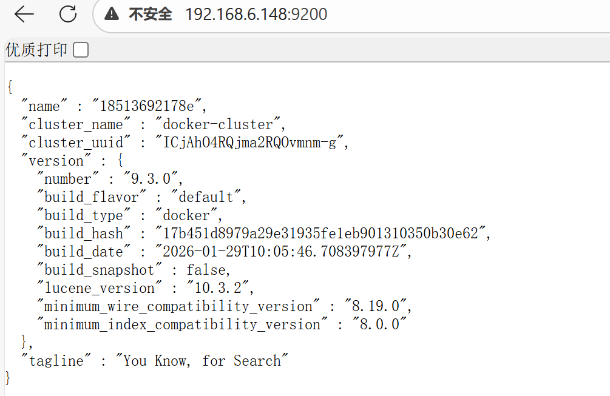
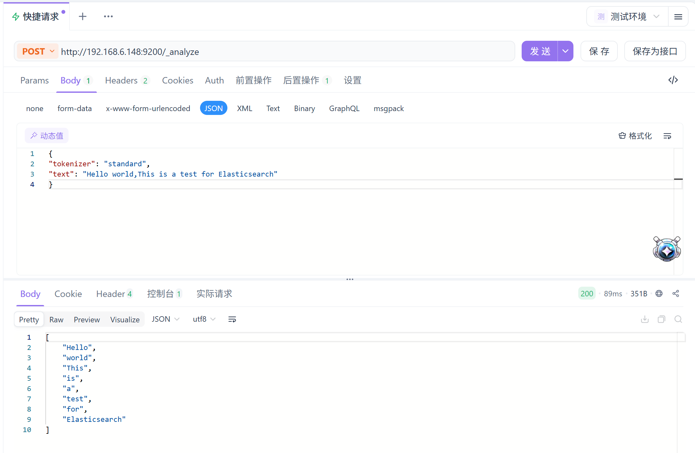
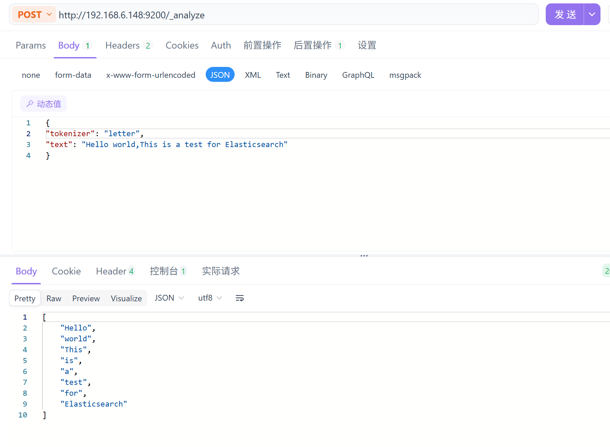
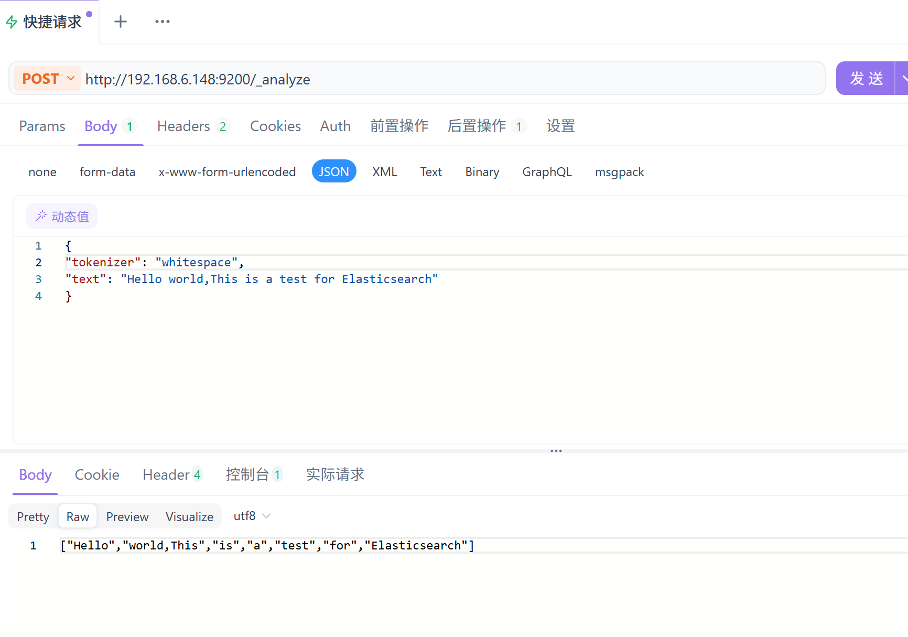
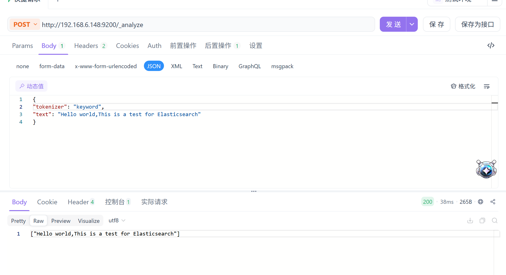
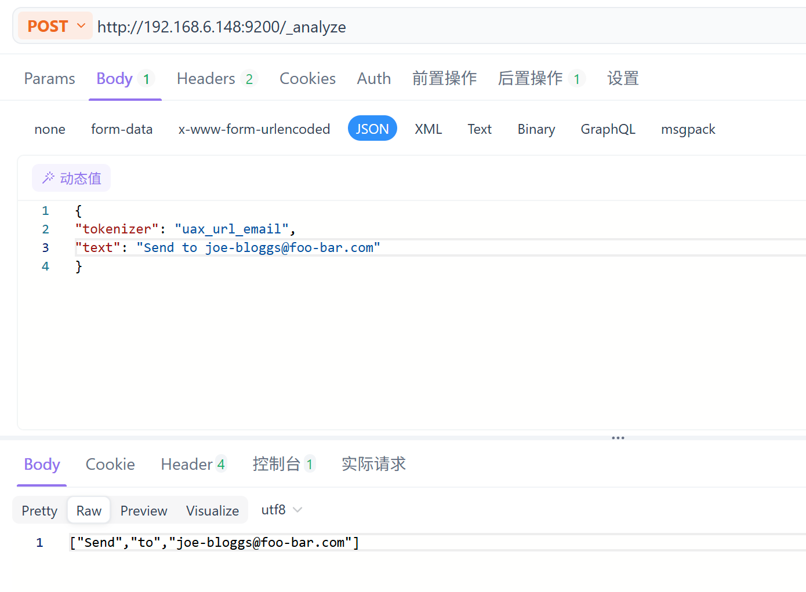
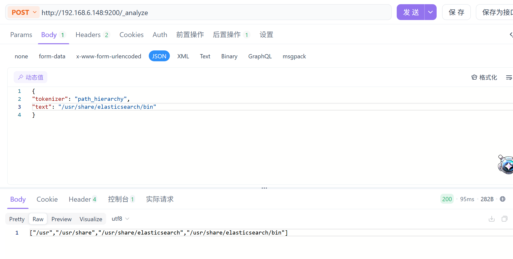

## Elasticsearch 部署练习
### 一、连接情况

### 二、分词器测试
#### 内置通用分词器
##### 1. standard

##### 2. letter

##### 3. letter

##### 4. keyword

##### 5. uax_url_email

##### 6. uax_url_email

#### 扩展（中文）分词器
> 插件未安装，未测试
##### 1. ik_smart
##### 1. ik_max_word

